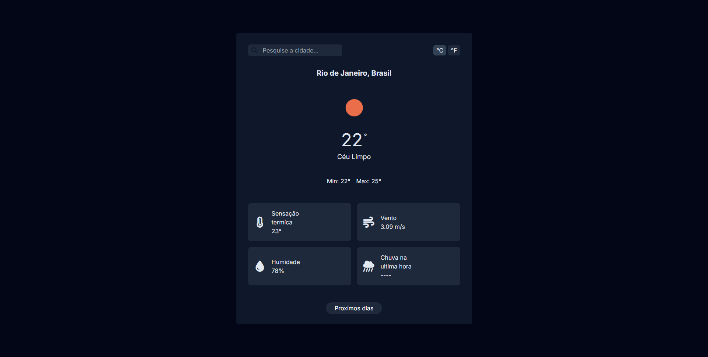
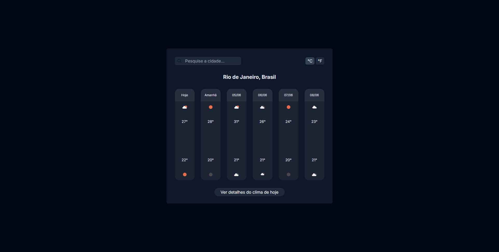

<p align="center">
  
  
  
  
  
</p>

# Weather App

A modern weather application built with vanilla JavaScript that displays current weather conditions and forecasts using the OpenWeatherMap API proxied through Vercel serverless functions.



## Features

- **Current Weather** — real-time conditions with temperature, humidity, wind, and rain
- **5-Day Forecast** — upcoming weather with daily min/max temperatures
- **Temperature Units** — switch between Celsius and Fahrenheit
- **City Search** — search weather for any city worldwide
- **Skeleton Loading** — smooth loading states while fetching data
- **Single Page Application** — client-side routing with no page reloads
- **Secure API** — API key is kept server-side via Vercel serverless functions
- **Responsive Design** — works on desktop and mobile



## Project Structure

```
weather-app/
├── api/
│   ├── weather.js              # Serverless function — current weather proxy
│   └── forecast.js             # Serverless function — forecast proxy
├── src/
│   ├── js/
│   │   ├── index.js            # App entry point, registers routes
│   │   ├── router.js           # Client-side SPA router
│   │   ├── weatherAPIHandler.js
│   │   └── forecastAPIHandler.js
│   ├── pages/
│   │   ├── current-weather.html
│   │   ├── forecast.html
│   │   └── 404.html
│   ├── assets/
│   │   └── weather-forecast.png
│   ├── input.css
│   └── output.css
├── .env.local.example          # Environment variable template
├── .gitignore
├── index.html
├── package.json
├── tailwind.config.js
├── vercel.json
└── README.md
```

## Getting Started (local development)

### Prerequisites

- [Node.js](https://nodejs.org/) v18 or higher
- [Vercel CLI](https://vercel.com/docs/cli) — required to run serverless functions locally
- An [OpenWeatherMap API key](https://openweathermap.org/api) (free tier is enough)

### 1. Clone the repository

```bash
git clone https://github.com/M-its/weather-appJS
cd weather-appJS
```

### 2. Install dependencies

```bash
npm install
npm install -g vercel
```

### 3. Configure environment variables

Copy the example file and fill in your API key:

```bash
cp .env.local.example .env.local
```

Open `.env.local` and replace the placeholder:

```
OPENWEATHER_API_KEY=your_actual_api_key_here
```

> ⚠️ `.env.local` is listed in `.gitignore` — never commit it.

### 4. Link the project to Vercel (first time only)

```bash
vercel link
```

Follow the prompts. When asked "Would you like to pull environment variables now?", answer **No** — you already have `.env.local`.

### 5. Start the development server

```bash
vercel dev
```

Open [http://localhost:3000](http://localhost:3000).

> `vercel dev` is required instead of `npm start` because it emulates the serverless functions in `api/`. Without it, the `/api/weather` and `/api/forecast` routes won't work.

---

## How the API proxy works

The browser never touches the OpenWeatherMap API directly. Every request goes through a Vercel serverless function:

```
Browser → /api/weather?q=city   →   api/weather.js (reads OPENWEATHER_API_KEY)   →   OpenWeatherMap
Browser → /api/forecast?q=city  →   api/forecast.js (reads OPENWEATHER_API_KEY)  →   OpenWeatherMap
```

The API key only exists in the server environment — it is never sent to the client.

---

### API Endpoints

The app uses two OpenWeatherMap endpoints:
- **Current Weather**: `https://api.openweathermap.org/data/2.5/weather`
- **5-Day Forecast**: `http://api.openweathermap.org/data/2.5/forecast`

## Navigation

- `/` — current weather page
- `/forecast` — 5-day forecast page
- anything else — 404 page

---

### Routing System

The application features a custom JavaScript router that:
- Handles browser history (back/forward buttons)
- Supports dynamic route registration
- Provides 404 error handling
- Maintains SPA functionality without page reloads

## Development

### Adding New Routes

To add a new route, modify `src/js/index.js`:

```javascript
router.add("/new-route", "/src/pages/new-page.html")
```

### Router API

The custom router supports:
- `router.add(path, htmlFile)` - Register a new route
- `router.handle()` - Process current URL
- `router.route()` - Navigate programmatically

---

## Technologies

- Vanilla JavaScript (ES6 modules)
- HTML5 / CSS3
- TailwindCSS
- Vercel Serverless Functions
- OpenWeatherMap API

## License

MIT